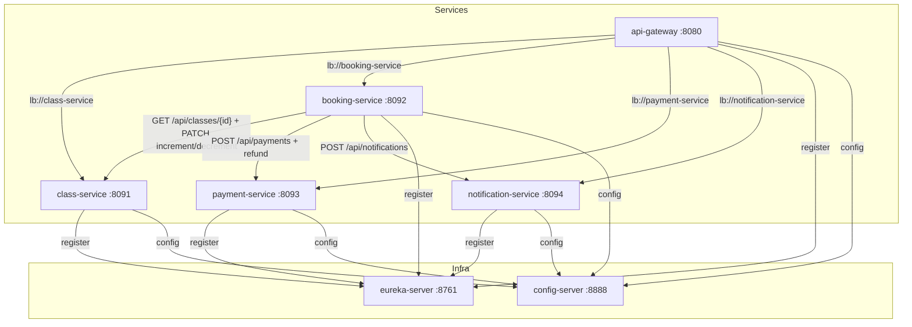

# FitConnect — Plateforme de Réservation de Cours de Sport

FitConnect est une plateforme de réservation de cours de sport. Ce projet implémente une architecture **microservices** avec Spring Boot / Spring Cloud : 4 services métier orchestrés par un pattern **Saga** (réservation → paiement → confirmation).

## Architecture



## Services

| Service | Port | Base H2 | Rôle |
|---|---|---|---|
| eureka-server | 8761 | — | Annuaire des services (service discovery) |
| config-server | 8888 | — | Configuration centralisée (config-repo) |
| api-gateway | 8080 | — | Point d'entrée unique (routage) |
| class-service | 8091 | classdb | CRUD des cours + gestion des places (verrouillage optimiste) |
| booking-service | 8092 | bookingdb | Réservations — orchestration Saga + scheduler |
| payment-service | 8093 | paymentdb | Paiements (simulation) + remboursements |
| notification-service | 8094 | notificationdb | Envoi de notifications (simulation) |

## Démarrage

### Avec Docker Compose (recommandé)

```bash
docker compose up --build
```

Attendez que tous les conteneurs soient `healthy`, puis patientez 20-30 s (rafraîchissement du cache Eureka côté gateway).

### Sans Docker (développement local)

Démarrez dans l'ordre, depuis la racine du projet (un terminal par service) :

```bash
mvn -pl config-server spring-boot:run        # :8888
mvn -pl eureka-server spring-boot:run        # :8761
mvn -pl class-service spring-boot:run        # :8091
mvn -pl booking-service spring-boot:run       # :8092
mvn -pl payment-service spring-boot:run      # :8093
mvn -pl notification-service spring-boot:run # :8094
mvn -pl api-gateway spring-boot:run          # :8080
```

### Vérifier la santé

```bash
./check-microservices-health.sh
```

Le script vérifie que Docker est lancé, que les 7 conteneurs sont `running`, et que chaque `/actuator/health` répond 200.

## Endpoints

Tous les endpoints passent par la gateway : `http://localhost:8080`.

### class-service — `/api/classes`

| Méthode | URL | Description |
|---|---|---|
| GET | `/api/classes` | Lister (filtres + pagination) |
| GET | `/api/classes/{id}` | Détails d'un cours |
| POST | `/api/classes` | Créer un cours |
| PUT | `/api/classes/{id}` | Mettre à jour |
| DELETE | `/api/classes/{id}` | Supprimer/annuler |
| PATCH | `/api/classes/{id}/increment?spots=N` | Incrémenter les participants (appelé par booking-service) |
| PATCH | `/api/classes/{id}/decrement` | Décrémenter les participants |
| GET | `/api/classes/search` | Recherche (date, catégorie, niveau, localisation) |

Filtres : `?category=YOGA&level=BEGINNER`, `?dateFrom=...&dateTo=...`, `?location=Paris&instructor=Marie`
Pagination : `?page=0&size=10&sort=dateTime,asc`

### booking-service — `/api/bookings`

| Méthode | URL | Description |
|---|---|---|
| GET | `/api/bookings` | Lister les réservations |
| GET | `/api/bookings/{id}` | Détails d'une réservation |
| GET | `/api/bookings/user/{userId}` | Réservations d'un utilisateur |
| POST | `/api/bookings` | Créer une réservation (Saga) |
| PATCH | `/api/bookings/{id}/confirm` | Confirmer après paiement |
| PATCH | `/api/bookings/{id}/cancel` | Annuler |
| PATCH | `/api/bookings/{id}/complete` | Marquer comme terminée |
| GET | `/api/bookings/expired` | Réservations en attente expirées |

### payment-service — `/api/payments`

| Méthode | URL | Description |
|---|---|---|
| POST | `/api/payments` | Traiter un paiement |
| GET | `/api/payments/booking/{bookingId}` | Paiement d'une réservation |
| POST | `/api/payments/{id}/refund` | Rembourser |
| GET | `/api/payments/user/{userId}` | Historique d'un utilisateur |

### notification-service — `/api/notifications`

| Méthode | URL | Description |
|---|---|---|
| POST | `/api/notifications` | Envoyer une notification |
| GET | `/api/notifications/user/{userId}` | Historique |
| GET | `/api/notifications/pending` | Notifications en attente |
| PATCH | `/api/notifications/{id}/retry` | Réessayer d'envoyer |

## Pattern Saga

Une réservation orchestre 3 services en cascade :

1. **Vérification du cours** : booking-service appelle `GET /api/classes/{id}` (class-service) et capture un snapshot (className, instructor, date, price)
2. **Réservation des places** : `PATCH /api/classes/{id}/increment?spots=N` — si plus de places → **409** (compensation : aucune réservation créée)
3. **Création de la réservation** : status `PENDING_PAYMENT`, `paymentDeadline = now + 1h`, `cancellationDeadline = classDate - 24h`
4. **Notification** : `POST /api/notifications` (BOOKING_CONFIRMATION)
5. **Paiement** : `PATCH /api/bookings/{id}/confirm` → `POST /api/payments` (payment-service) → status `CONFIRMED`
6. **Annulation** : `PATCH /api/bookings/{id}/cancel` → refund + libération des places + notification

## Verrouillage optimiste

`class-service` utilise un champ `@Version` sur `FitnessClass` pour empêcher les surréservations. Si deux réservations concurrentes tentent d'incrémenter les participants, JPA lève une `ObjectOptimisticLockingFailureException` → **409 Conflict**.

## Scheduler

`booking-service` (via `@Scheduled`) :
- **Expiration des paiements** (toutes les 5 min) : annule les réservations `PENDING_PAYMENT` dont la `paymentDeadline` est dépassée, libère les places, envoie une notification
- **Rappel des cours** (24h avant) : notifie les réservations `CONFIRMED` dont le cours commence dans 24h

## Circuit Breaker

Les clients Feign de `booking-service` sont protégés par un Circuit Breaker (resilience4j) : si class-service, payment-service ou notification-service est indisponible, booking-service répond proprement (502) au lieu de planter.

## Tests

```bash
mvn test            # tous les modules
mvn -pl <service> test
```

Chaque service a des tests unitaires (Mockito) et d'intégration (MockMvc), couvrant en particulier les cas d'erreur (409 surréservation, paiement expiré, annulation hors délais).

## Collection Postman

Une collection complète est disponible dans `postman/FitConnect.postman_collection.json` — importez-la dans Postman et exécutez les scénarios via la gateway (:8080).
